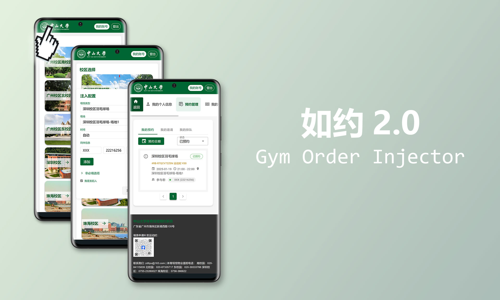

## Gym Order Injector

goInjector (Gym Order Injector) 是一款针对大山中学体育场馆预约系统的订单数据模拟工具。它通过`油猴`（电脑端）、`Userscripts`（IOS端）或 `PCAPdroid mitm`（安卓端）注入 JS 代码的方式，提供了一个功能强大的可视化配置界面，让用户能够灵活地设置各项参数并自动生成订单数据。该工具的主要优势包括：

1. 直观友好的配置界面，操作简单方便
2. 基于真实网站环境运行，具有极高的模拟真实度
3. 一种一劳永逸的方法，只要网站核心接口未发生变化，便可自动适配网站的后续更新迭代
4. 仅校内用户可以使用且具有一定配置门槛，有效控制使用范围，防止脚本被滥用

### 演示

<video src="https://github.com/user-attachments/assets/813ba0b6-da39-4d1e-802e-a52d6d1bd139" controls="controls" style="max-height:320px; min-height: 240px"></video>

### 部署（企业微信注入）

> 该方法部署复杂但更为真实
> 仅适用于安卓设备，iOS设备请自行探索合适的注入方案

1. 安装抓包软件：在安卓设备上安装 `PCAPdroid` 和 `PCAPdroid mitm` 两个应用程序
2. 配置 CA 证书：进入 `PCAPdroid` 设置界面，选择 `Mitm 设置向导` 并按提示完成证书配置
3. 部署注入插件：启动 `PCAPdroid mitm`，在 `ADDONS` 中启用 `JS Injector`，点击设置按钮后通过右上角 `+` 添加目标网址 `https://raw.githubusercontent.com/jungheil/goInjector/main/goInjector.user.js`
4. 设置解密规则：在 `PCAPdroid` 菜单中选择 `解密规则`，添加主机名 `gym.susy.edu.cn`（如遇问题可改为添加 `企业微信` 应用）
5. 配置目标应用：在 `PCAPdroid` 中将 `企业微信` 设为抓包目标应用

### 部署（浏览器插件）

> 该方法部署简单
> 电脑端、IOS端、安卓端均可使用

1. 安装浏览器插件
   * 电脑端：安装 `Tampermonkey` 插件
   * 安卓端：使用 `Firefox` 、`Edge` 等支持 `Tampermonkey` 插件的浏览器
   * IOS端：应用商店安装 `Safari` 插件 `Userscripts`
2. 开启插件
3. 访问插件地址：[https://raw.githubusercontent.com/jungheil/goInjector/main/goInjector.user.js](https://raw.githubusercontent.com/jungheil/goInjector/main/goInjector.user.js)
4. 安装插件

### 使用说明（企业微信注入）

1. 启动抓包软件：同时运行 `PCAPdroid` 和 `PCAPdroid mitm`，在 `PCAPdroid` 界面点击右上角开始抓包
2. 进入预约系统：通过企业微信工作台访问体育场馆预定系统
3. 确保插件加载：如未检测到插件，请点击右上角三点菜单进行刷新
4. 打开配置界面：在页面左上角找到透明按钮区域（大概位于logo区域），长按约 0.8 秒后松开即可唤出配置对话框
5. 设置订单参数：根据需求配置相关订单信息
6. 验证注入结果：检查订单列表确认操作是否成功

### 使用说明（浏览器插件）

1. 进入预约系统：通过浏览器访问体育场馆预定系统
2. 确保插件加载：检查 `Tampermonkey` 或 `Userscripts` 中注入插件是否开启
3. 打开配置界面：在页面左上角找到透明按钮区域（大概位于logo区域），长按约 0.8 秒后松开即可唤出配置对话框
4. 设置订单参数：根据需求配置相关订单信息
5. 验证注入结果：检查订单列表确认操作是否成功

### 常见问题

1. Q: 已设置参数但订单未显示在列表中
   
   A: 请检查是否有必填参数未配置，确保所有必要的参数都已正确设置

2. Q: 长按左上角区域无法唤出配置界面
   
   A: 长按位置不准确，建议调整按压位置并保持约0.8秒后松开；插件未成功加载，请确认抓包软件是否正常运行，检查注入脚本是否成功被下载，尝试多次刷新页面，如仍无效可重启相关软件后重试

3. Q: 使用该脚本是否存在安全隐患？
   
   A: 本工具所有操作均在本地执行，不涉及服务器交互，理论上十分安全

### 声明

本项目按“现状”提供，仅供技术学习和交流使用，不提供任何明示或暗示的保证。在任何情况下，作者或版权所有者不对任何索赔、损害或其他责任负责。本项目使用本项目所产生的任何违规行为与作者无关。

如有任何问题或侵权行为，请及时与作者联系，我将立即删除相关内容。

使用本项目即表示您已完全理解并同意:

1. 本项目仅用于学习和研究目的
2. 不得将本项目用于任何违法或不当用途
3. 使用本项目所造成的任何后果由使用者自行承担
